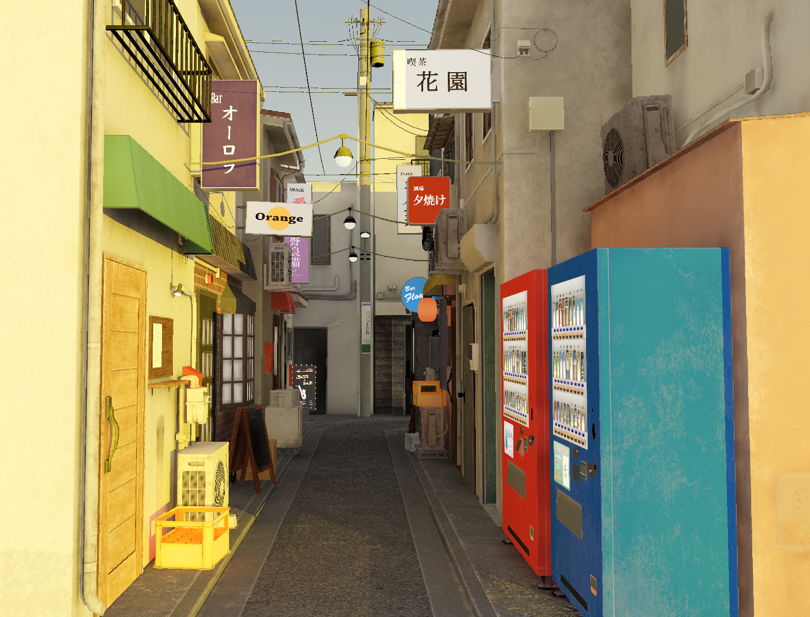

# SurfelPlus Readme

**University of Pennsylvania, CIS 565: GPU Programming and Architecture, Final Project.**

*A project by Zhen Ren, Ruipeng Wang and Jinxiang Wang*

This project is developed base on Nvidia's [vk_raytrace renderer](https://github.com/nvpro-samples/vk_raytrace/tree/master).

**IMPORTANT**: This readme file will only include the basic setup and usage for this project. For a complete development log and demo, please visit this site: [SurfelPlus Project Page](https://wang-ruipeng.github.io/SurfelPlus/)

## Demos


https://github.com/user-attachments/assets/2aecac2c-b9ec-486c-b237-a38070e0a42e

## Introduction

**SurfelPlus** is a real-time dynamic global illumination renderer built on top of NVIDIA's vk_raytrace framework. Using **Vulkan ray tracing** and **surfel-based** techniques, SurfelPlus aims to deliver high-quality lighting effects with dynamic scene updates, providing an efficient solution for realistic and immersive visual rendering in real time.

## Setup

You can use cmake to build this project.

```
git clone https://github.com/WANG-Ruipeng/SurfelPlus.git
cd ./SurfelPlus
mkdir build
cd ./build
cmake-gui ..
```

- The original vk_raytrace renderer will require cloning both the nvpro_core and the vk_raytrace renderer itself. In our project, we did this for you so you only have to clone this repository.
- We recommend build this project based on Visual Studio 2022 as it is used by everyone in the team.

## Usage

**Controls**

| Action | Description |
| --- | --- |
| `LMB` | Rotate around the target |
| `RMB` | Dolly in/out |
| `MMB` | Pan along view plane |
| `LMB + Shift` | Dolly in/out |
| `LMB + Ctrl` | Pan |
| `LMB + Alt` | Look around |
| `Mouse wheel` | Dolly in/out |
| `Mouse wheel + Shift` | Zoom in/out (FOV) |
| `Space` | Set interest point on the surface under the mouse cursor. |
| `F10` | Toggle UI pane. |

**Change glTF model**

- Drag and drop glTF files (`.gltf` or `.glb`) into viewer

**Change HDR lighting**

- Drag and drop HDR files (`.hdr`) into viewer

## Loading Different Models

All of the scene file resources are under `downloaded_resources` folder. You can edit the `main` function in the `main.cpp` file to load different models.

```cpp
InputParser parser(argc, argv);
std::string sceneFile   = parser.getString("-f", "Sponza/Sponza.gltf");
std::string hdrFilename = parser.getString("-e", "std_env.hdr");
```

Enjoy! :)

## Surfel GI Render Passes Overview

- Prepare Stage
    - Gbuffer Pass
- Surfel Calculation Stage
    - Surfel Prepare Pass
    - Surfel Update Pass
    - Cell Info Update Pass
    - Cell to Surfel Update Pass
    - Surfel Ray Trace Pass
    - Surfel Generation & Evaluation Pass
- Reflection Calculation Stage
    - Reflection Trace Pass
    - Spatial Temporal Filtering Pass
    - Bilateral Filtering Pass
- Integrate Stage
    - SSAO Pass
    - Light Integrate Pass
    - TAA Pass
    - Tone Mapping Pass

### Gbuffer Pass


### Surfel Prepare Pass


### Surfel Update Pass


### Cell Info Update Pass


### Cell to Surfel Update Pass


### Surfel Ray Trace Pass


### Surfel Generation & Evaluation Pass


### Reflection Trace Pass


### Spatial Temporal Filtering Pass


### Bilateral Filtering Pass


### SSAO Pass


### Light Integrate Pass


### TAA Pass


### Tone Mapping Pass