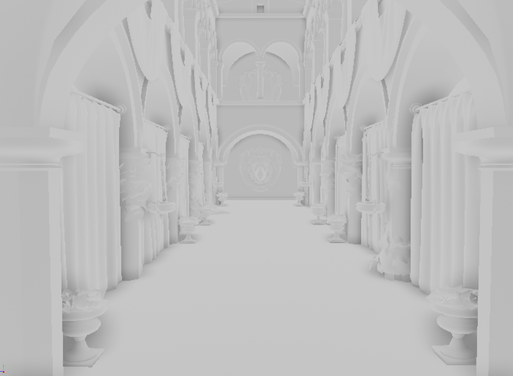
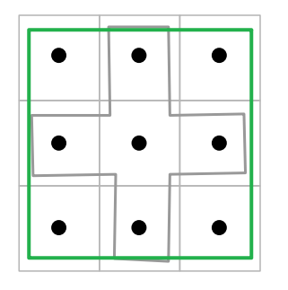

# SurfelPlus Readme

**University of Pennsylvania, CIS 565: GPU Programming and Architecture, Final Project.**

_A project by Zhen Ren, Ruipeng Wang and Jinxiang Wang_

This project is developed base on Nvidia's [vk_raytrace renderer](https://github.com/nvpro-samples/vk_raytrace/tree/master).

**IMPORTANT**: This readme file will only include the basic setup and usage for this project. For a complete development log and demo, please visit this site: [SurfelPlus Project Page](https://wang-ruipeng.github.io/SurfelPlus/)

## Demos


https://github.com/user-attachments/assets/2aecac2c-b9ec-486c-b237-a38070e0a42e

## Introduction

**SurfelPlus** is a real-time dynamic global illumination renderer built on top of NVIDIA's vk_raytrace framework. Using **Vulkan ray tracing** and **surfel-based** techniques, SurfelPlus aims to deliver high-quality lighting effects with dynamic scene updates, providing an efficient solution for realistic and immersive visual rendering in real time.


## Setup

You can use cmake to build this project.

```
git clone https://github.com/WANG-Ruipeng/SurfelPlus.git
cd ./SurfelPlus
mkdir build
cd ./build
cmake-gui ..
```

-   The original vk_raytrace renderer will require cloning both the nvpro_core and the vk_raytrace renderer itself. In our project, we did this for you so you only have to clone this repository.
-   We recommend build this project based on Visual Studio 2022 as it is used by everyone in the team.

## Usage

**Controls**

| Action                | Description                                               |
| --------------------- | --------------------------------------------------------- |
| `LMB`                 | Rotate around the target                                  |
| `RMB`                 | Dolly in/out                                              |
| `MMB`                 | Pan along view plane                                      |
| `LMB + Shift`         | Dolly in/out                                              |
| `LMB + Ctrl`          | Pan                                                       |
| `LMB + Alt`           | Look around                                               |
| `Mouse wheel`         | Dolly in/out                                              |
| `Mouse wheel + Shift` | Zoom in/out (FOV)                                         |
| `Space`               | Set interest point on the surface under the mouse cursor. |
| `F10`                 | Toggle UI pane.                                           |

**Change glTF model**

-   Drag and drop glTF files (`.gltf` or `.glb`) into viewer

**Change HDR lighting**

-   Drag and drop HDR files (`.hdr`) into viewer

## Loading Different Models

All of the scene file resources are under `downloaded_resources` folder. You can edit the `main` function in the `main.cpp` file to load different models.

```cpp
InputParser parser(argc, argv);
std::string sceneFile   = parser.getString("-f", "Sponza/Sponza.gltf");
std::string hdrFilename = parser.getString("-e", "std_env.hdr");
```

Enjoy! :)

## Surfel GI Render Passes Overview

-   Prepare Stage
    -   Gbuffer Pass
-   Surfel Calculation Stage
    -   Surfel Prepare Pass
    -   Surfel Update Pass
    -   Cell Info Update Pass
    -   Cell to Surfel Update Pass
    -   Surfel Ray Trace Pass
    -   Surfel Generation & Evaluation Pass
-   Reflection Calculation Stage
    -   Reflection Trace Pass
    -   Spatial Temporal Filtering Pass
    -   Bilateral Filtering Pass
-   Integrate Stage
    -   SSAO Pass
    -   Light Integrate Pass
    -   TAA Pass
    -   Tone Mapping Pass

### Gbuffer Pass

The G-Buffer Pass is responsible for capturing per-pixel information about the scene's geometry and surface properties, which are later used in lighting and shading computations. This pass encodes data such as primitive object ID, compressed world-space normals, and other attributes necessary for the rendering pipeline.


### Surfel Prepare Pass

A pass that reset some counters and prepares all the buffer for later accumulation.

### Surfel Update Pass

The Surfel Update Pass is responsible for maintaining and updating the dynamic surfel data in real time. It processes active surfels to:

-   Recycle expired or invalid surfels based on specific criteria, such as lifespan, distance from the camera, total surfel count, or visibility status.

-   Adjust surfel radius dynamically based on camera distance and scene conditions to balance performance and visual quality. The cell radius is bounded by cell size to keep surfels right in their cells.

-   Distribute surfels into appropriate grid cells for efficient spatial queries and interactions. Surfels would check the surrounding 3x3 cells so that surfels crossing multiple cells can be correctly recorded in each cell.

-   Allocate ray resources for surfel-based global illumination calculations, ensuring adequate sampling for indirect lighting. The ray allocation is influenced by surfel variance, surfel life and surfel visibility.

This pass ensures the surfel system remains efficient and responsive to scene changes, supporting real-time dynamic global illumination with consistent performance. However, surfel recycle may dispose some surfels in unseen area, causing the GI to re-converge when camera looks at them.

### Cell Info Update Pass

Pre-allocate the offset and range of cell to surfel buffer.

### Cell to Surfel Update Pass

Populate data in cell to surfel buffer.

### Surfel Ray Trace Pass

The Surfel Ray Tracing Pass is responsible for casting rays from surfels to compute their radiance, which is essential for indirect lighting in the scene. This pass integrates ray-guiding sampling and cosine-weighted hemisphere sampling to ensure accurate and efficient light transport calculations.

Ray Generation: Uses either ray-guided sampling (based on irradiance maps) or cosine-weighted sampling (based on the surfel’s orientation) to determine the direction of rays. The ray-guided sampling prioritizes high-irradiance directions for better accuracy, while cosine-weighted sampling provides fallback sampling when irradiance data is insufficient. The surfel radiance in each direction is written to a irradiance map which is a 4K texture atlas. Each surfel has a 6x6 quad to store their radiance in each direction.


Radiance Calculation: Casts rays from surfel positions into the scene using our custom path tracing method. When rays hit an emissive surface or sky, it would return the corresponding radiance. If not, we would try to finalize the path using existing surfels.

When a ray reach its maximum depth but receiving not lights, we can use the surrounding surfels to provide diffuse indirect lighting for that ray. The helps the scene to converge faster. However, if there are many surfels nearby, sampling all of them would cause a huge performance deration. Therefore, a stochastic sampling strategy would be used to limit the number of surfel samples.

Surfel Ray Updates: Updates each surfel ray with its computed radiance, direction, and probability density function for use in subsequent lighting computations. Here, we also clamps high luminance values to improve stability and avoid firefly effects in the scene.

Dynamic Adjustments: Adapts ray tracing depth based on the surfel’s activeness to optimize performance without sacrificing realism.

This pass is critical for accurately simulating light propagation in the scene, contributing to the high-quality global illumination achieved by SurfelPlus.

### Surfel Integrate Pass

The Surfel Integration Pass is responsible for aggregating the radiance contributions collected by surfel rays, updating surfel properties, and sharing irradiance data among nearby surfels. This pass plays a crucial role in achieving consistent and smooth global illumination.

Radiance Aggregation: Gathers and accumulates radiance data from surfel rays stored in the memory. Each surfel would have maximum 64 rays in each frame. These rays are divided to 4 packs and each pack would contribute to the surfel irradiance using MSME. MSME algorithm would also calculate the surfel variance and accumulation weight so that surfels can be more responsive to environment change and converge in a smoother way.

Irradiance Map Update: Updates the irradiance map for each surfel, storing directional irradiance information in a 6x6 grid for efficient reuse in guided sampling. We also writes depth information into a corresponding depth map to assist with visibility checks.

Shared Radiance Contribution: Enables nearby surfels to share irradiance data within a local spatial cell. This step accelerate surfel convergence a lot. Uses factors like normal alignment, distance, and surfel lifespan to weight contributions, ensuring consistent and plausible lighting. Stochastic sampling strategy is also applied here.

Adaptive Integration: Differentiates behavior for newly created surfels and established ones to avoid sudden changes in irradiance values. Then, we normalizes contributions across samples, ensuring accurate energy conservation.

This pass ensures that surfels maintain smooth and stable lighting across frames while leveraging shared data to enhance global illumination accuracy and performance.


### Surfel Generation & Evaluation Pass

The Surfel Generation Pass computes indirect lighting contributions for each pixel based on nearby surfels, updates shading information, and dynamically generates new surfels to ensure adequate coverage in the scene. This pass evaluates the lighting of the rendered image by incorporating smooth and detailed global illumination.

Indirect Lighting Calculation: Aggregates irradiance contributions from nearby surfels within the same spatial cell. Factors like distance, normal alignment, and surfel radius are used to weight contributions, ensuring realistic lighting effects.


Coverage and Contribution Analysis: Evaluates coverage and contribution metrics of each pixel determine lighting consistency and detect potential gaps in surfel representation.

Dynamic Surfel Generation: Generates new surfels dynamically in underrepresented regions to maintain proper lighting coverage. The position, radius, and radiance of new surfels are initialized based on the scene’s current lighting conditions.

Debugging and Visualization: Here, we provide supports multiple debugging modes, including visualizing radiance, surfel IDs, variance, and surfel radius. This provides insights into surfel contributions and the overall quality of indirect lighting.

Adaptive Surfel Removal: Removes surfels in regions with excessive coverage to optimize surfel layout memory usage and computational performance.

This pass evaluates the indirect diffuse lighting using nearby surfels, while dynamically adapting the surfel distribution to maintain high-quality and uniform global illumination in real-time scenarios.


### Reflection Trace Pass

The Reflection Compute Pass computes specular reflections using RIS. It calculates accurate reflection contributions while efficiently handling complex material properties and varying surface roughness.

RIS: Implements a weighted reservoir sampling approach to select the best reflection candidate based on target contribution weights.

Reflection Computation: Traces reflection rays to gather radiance from the scene using both raw trace and surfel-based indirect lighting. The idea is similar to surfel ray trace. This approach accelerate reflection convergence surprisingly.

| Without surfel indirect, max bounce = 6 | With surfel indirect, max bounce = 1  |
| :-------------------------------------: | :-----------------------------------: |
|   |  |

From the above image, you can see the huge difference achieved by surfel indirect lighting even with only 1 bounce.

Firefly Suppression: Includes a threshold-based luminance clamp to prevent outliers (fireflies) in the reflection output, ensuring stable and realistic visuals.

This pass provides high-quality specular reflections, essential for realistic rendering of glossy and metallic surfaces, while maintaining efficiency through RIS and surfel indirect lighting techniques.

### Spatial Temporal Filtering Pass

The Spatial Temporal Filtering Pass refines the specular reflection data by applying spatial reconstruction and temporal accumulation techniques. This pass ensures smooth and visually accurate reflections while mitigating noise and artifacts.

Spatial Reconstruction Filtering: Uses a neighborhood sampling pattern to collect and average reflection data from nearby pixels. Incorporates sample weighting based on BRDF contributions, material consistency, and PDF values to prioritize relevant samples.

Material Consistency Check: Ensures that only samples with matching material IDs contribute to the reflection data, preserving material-specific characteristics.

Variance Calculation: Computes the variance of sampled contributions to measure the reliability and stability of the filtered reflections.

Temporal Accumulation: Combines current filtered results with the previous frame’s reflections to enhance temporal stability and reduce flickering.


Adaptive Sampling Patterns: Leverages stochastic sampling with predefined patterns (Blue noise disk in our code) to balance performance and quality across different pixel regions. Since the raw tracing result is in a half resolution texture, each half res pixel corresponds to a 2x2 quad in spatial filtering. Therefore, we apply different sampling pattern by threshold a blue noise texture into 4 parts.


### Bilateral Filtering Pass

The Bilateral Cleanup Pass refines the filtered reflection data by applying a bilateral filter that considers spatial, color, and normal similarity. This pass enhances the smoothness of reflections while preserving sharp edges and important details.

Variance-Based Filtering: Handles pixels differently based on their variance:
Culled Pixels: Variance below a threshold results in the pixel being discarded.
Low-Variance Pixels: Retains the original reflection data.

High-Variance Pixels: Applies bilateral filtering to smooth the data.

Bilateral Filtering:Combines three weights to refine the reflection data:
Spatial Weight: Penalizes contributions from farther neighbors.

Range Weight: Reduces the impact of neighbors with significantly different colors.

Normal Weight: Incorporates geometric similarity by considering surface normal alignment.

Dynamic Kernel Radius: Adapts the filter kernel radius based on pixel variance, allowing for more aggressive smoothing in high-variance areas while maintaining sharpness elsewhere.

Edge Preservation: Ensures that boundaries and fine details are preserved by factoring in normal similarity and color differences.

This pass ensures high-quality reflection visuals by reducing noise and artifacts while maintaining important surface details and transitions, providing a polished final image.


### SSAO Pass

A ssao pass to add more realism to the scene. Use temporal accumulation to do denoising.



### Light Integrate Pass

This pass calculates **direct lighting** and integrats it with **indirect and reflection** information that gathered from previous passes.  
Information needed (material, world position, etc.) for Direct lighting was obtained and uncompressed/reconstructed from G-Buffer, then ray-query features was used to compute shading accordingly.

|                Combined                |               Direct Lighting                |               Indirect Lighting                |                Reflection                |
| :------------------------------------: | :------------------------------------------: | :--------------------------------------------: | :--------------------------------------: |
|  |  |  |  |

### TAA Pass

The TAA pass **jitters** the view frustum and strategically **averges** the color between multiple frames.

Position Reconstruction: Reconstruct world position using depth buffer and screen uv.

Previous Frame Reprojection: Using the view-projection matrix of last frame to calculate uv of world position of current pixel in last frame.

|             Reprojection             |
| :----------------------------------: |
|  |

Neighbor Color Vector AABB: Sample the 3x3 neighbor color and adjacent neighbor color (surrounding pixels in "+" pattern), calculate aabb of color vector

|              AABB              |
| :----------------------------: |
|  |

Neighbor Color Clipping: clip the current color towards history color instead of just clamping it. In this way color from previous frame is trivially accepted to reduce ghost and smearing effect.

|       Clamping and Clipping       |
| :-------------------------------: |
|  |

Blend and weigh history frames: Lerp between colors of past frame and this frame. Higher feedback factor will have a faster converge but will introduce artifacts.

|             Blend             |
| :---------------------------: |
|  |

Sharpen: Filter the final image with Laplace operator

|            No TAA             |           TAA (Unsharpened)            |            TAA (Sharpened)             |
| :---------------------------: | :------------------------------------: | :------------------------------------: |
|  |  |  |
